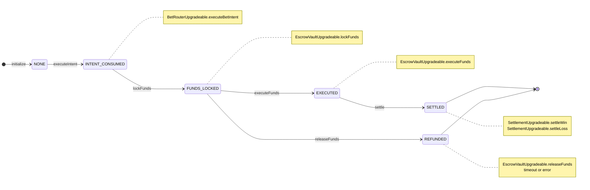

# 预测市场聚合器-合约模块

## 模块结构

```text
ForecastAggregationContract/
├── contracts/
│   ├── interface/
│   │   ├── IBetRouter.sol              # 下注的接口文件
│   │   ├── IEscrowVault.sol            # 下注资金的Vault接口文件
│   │   ├── IOracleAdapter.sol          # 项目预言机的接口文件(接收预测事件结果)
│   │   └── ITopicRegistry.sol          # 预测事件注册的接口文件
│   ├── test/                           # 用于测试协作的solidity文件目录
│   ├── BetRouterUpgradeable.sol        # 下注生成betId的合约
│   ├── EscrowVaultUpgradeable.sol      # 下注资金的Vault合约(负责资金锁定、资金退还、资金流转下注钱包)
│   ├── FeeVault.sol                    # 项目的收费Vault合约
│   ├── OracleAdapterUpgradeable.sol    # 项目预言机的合约
│   ├── ProtocolAccessUpgradeable.sol   # 项目权限控制合约
│   ├── SettlementUpgradeable.sol       # 结算合约
│   └── TopicRegistryUpgradeable.sol    # 预测事件注册的合约
├── test/                               # 测试脚本目录
├── .gitignore                          # git忽略文件
├── foundry.toml                        # foundry配置文件
├── hardhat.config.js                   # hardhat配置文件
├── package.json                        # 项目依赖包
└── README.md                           # 项目说明
```

## BetStatus状态机


## Sepolia测试链部署地址链接
> [BetRouterUpgradeable.sol合约交易详情 --- 还未部署]()  
> [EscrowVaultUpgradeable.sol合约交易详情 --- 还未部署]()  
> [FeeVault.sol合约交易详情 --- 还未部署]()  
> [OracleAdapterUpgradeable.sol合约交易详情 --- 还未部署]()  
> [ProtocolAccessUpgradeable.sol合约交易详情 --- 还未部署]()
> [SettlementUpgradeable.sol合约交易详情 --- 还未部署]()  
> [TopicRegistryUpgradeable.sol合约交易详情 --- 还未部署]()

## 合约部署顺序

> 1. ProtocolAccessUpgradeable.sol  
> 2. BetRouterUpgradeable.sol  
> 3. FeeVault.sol  
> 4. TopicRegistryUpgradeable.sol  
> 5. OracleAdapterUpgradeable.sol  
> 6. EscrowVaultUpgradeable.sol
> 7. SettlementUpgradeable.sol    


