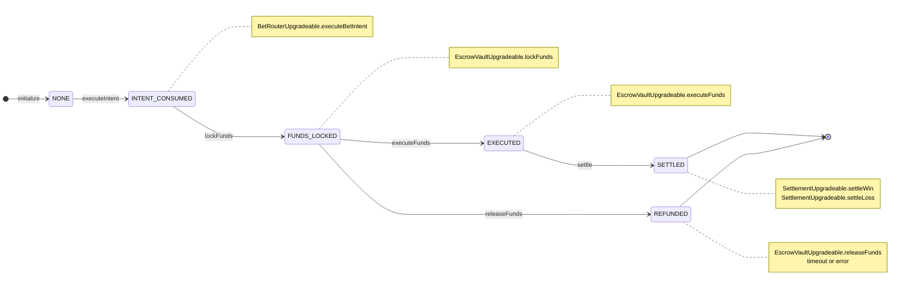

# 预测市场聚合器-合约模块

## 模块结构

```text
ForecastAggregationContract/
├── contracts/
│   ├── interface/
│   │   ├── IBetRouter.sol                  # 下注的接口文件
│   │   ├── IEscrowVault.sol                # 下注资金的Vault接口文件
│   │   ├── IOracleAdapter.sol              # 项目预言机的接口文件(接收预测事件结果)
│   │   └── ITopicRegistry.sol              # 预测事件注册的接口文件
|   ├── lib/                                # 合约中需要用到的方法库
│   │   └── ProtocolAccessLib.sol           # 项目权限控制相关方法库
│   ├── test/                               # 用于测试协作的solidity文件目录
│   │   └── ForecastAggregationERC20.sol    # 项目联调测试所使用的ERC20合约
│   ├── BetRouterUpgradeable.sol            # 下注生成betId的合约
│   ├── EscrowVaultUpgradeable.sol          # 下注资金的Vault合约(负责资金锁定、资金退还、资金流转下注钱包)
│   ├── FeeVault.sol                        # 项目的收费Vault合约
│   ├── OracleAdapterUpgradeable.sol        # 项目预言机的合约
│   ├── ProtocolAccessUpgradeable.sol       # 项目权限控制合约
│   ├── SettlementUpgradeable.sol           # 结算合约
│   └── TopicRegistryUpgradeable.sol        # 预测事件注册的合约
├── test/                                   # 测试脚本目录
│   ├── create_executeBetIntent_param.js    # 生成BetRouterUpgradeable.sol的executeBetIntent函数中所需的signature与生成的betId
│   ├── create_status_sig.js                # 生成BetRouterUpgradeable.sol的updateBetStatusWithSig函数中的bytes calldata signature参数，里面编写了前端应该如何生成的signature格式
│   └── test.js                             # 修改代码过程的测试脚本
├── .gitignore                              # git忽略文件
├── foundry.lock                            # foundry的项目依赖包
├── foundry.toml                            # foundry配置文件
├── hardhat.config.js                       # hardhat配置文件
├── package.json                            # hardhat的项目依赖包
└── README.md                               # 项目说明
```

## BetStatus状态机

```mermaid

%%{init: {
  "state": {
    "nodeSpacing": 10,
    "rankSpacing": 10
  }
}}%%

stateDiagram-v2
    direction LR

    [*] --> NONE : initialize

    NONE --> INTENT_CONSUMED : executeIntent
    INTENT_CONSUMED --> FUNDS_LOCKED : lockFunds
    FUNDS_LOCKED --> EXECUTED : executeFunds

    EXECUTED --> SETTLED : settle
    FUNDS_LOCKED --> REFUNDED : releaseFunds

    SETTLED --> [*]
    REFUNDED --> [*]

    note right of INTENT_CONSUMED
        BetRouterUpgradeable.executeBetIntent
    end note

    note right of FUNDS_LOCKED
        EscrowVaultUpgradeable.lockFunds
    end note

    note right of EXECUTED
        EscrowVaultUpgradeable.executeFunds
    end note

    note right of SETTLED
        SettlementUpgradeable.settleWin
        SettlementUpgradeable.settleLoss
    end note

    note right of REFUNDED
        EscrowVaultUpgradeable.releaseFunds
        timeout or error
    end note

```

## Sepolia测试链部署地址链接
> [ForecastAggregationERC20.sol合约交易详情](https://sepolia.etherscan.io/address/0x6fa98CCFC8E55c9Bf88cf0E2Be0E7d9842dA29DB)  
> [BetRouterUpgradeable.sol合约交易详情](https://sepolia.etherscan.io/address/0x9fB3a60a698b5a9e891E575Aa908B771dd150Df9)  
> [EscrowVaultUpgradeable.sol合约交易详情](https://sepolia.etherscan.io/address/0x4d164Ba20F1390aC0EDDA79FcC0eE7c165394F97)  
> [FeeVault.sol合约交易详情](https://sepolia.etherscan.io/address/0x618670852ac2fa37B70c65eEA02BfA8afCB3114F)  
> [OracleAdapterUpgradeable.sol合约交易详情 ---  组内沟通后(弃用)]()  
> [ProtocolAccessUpgradeable.sol合约交易详情](https://sepolia.etherscan.io/address/0xAD364B81421E6b82739411b9B358ea2A893053Ee)  
> [SettlementUpgradeable.sol合约交易详情](https://sepolia.etherscan.io/address/0xFC8D307ffe1347F885582b443033e0c189D6b791)  
> [TopicRegistryUpgradeable.sol合约交易详情 ---  组内沟通后(弃用)]()

## 合约部署顺序

> 1. ForecastAggregationERC20.sol
> 2. ProtocolAccessUpgradeable.sol  
> 3. BetRouterUpgradeable.sol  
> 4. FeeVault.sol  
> 5. TopicRegistryUpgradeable.sol(已弃用)  
> 6. OracleAdapterUpgradeable.sol(已弃用)  
> 7. EscrowVaultUpgradeable.sol
> 8. SettlementUpgradeable.sol    

## 部署,联调时的注意项

> 1. 需要给能调用BetRouterUpgradeable.sol中updateBetStatusWithSig函数负责给前端签名的前端钱包EXECUTOR_ROLE角色
> 2. 需要使用EscrowVaultUpgradeable.sol中的executedFunds必须给后端执行下注的钱包EXECUTOR_ROLE角色
> 3. 调用EscrowVaultUpgradeable.sol中的lockFunds前需要让msg.sender给EscrowVaultUpgradeable.sol地址授权ERC20额度
> 4. 联调验证阶段需要找Rid要对应的测试ERC20 Token(模拟线上USDT),联调中需要使用到
> 5. 需要对平台的FeeVault.sol(即用户在平台下注盈利后抽点的平台费)，提现的账户钱包必须有WITHDRAW_ROLE角色

## 拉取代码后如何部署

> ### 拉取依赖命令
> ```shell
> npm install
> ```  
> 
> ### 部署命令
> ```shell
> npx hardhat deploy --tags ForecastAggregation_V1 --network sepolia
> ```  

> ### 测试命令
> ```shell
> npx hardhat test test/test.js --network sepolia
> node test/create_executeBetIntent_param.js
> node test/create_status_sig.js
> ```  


