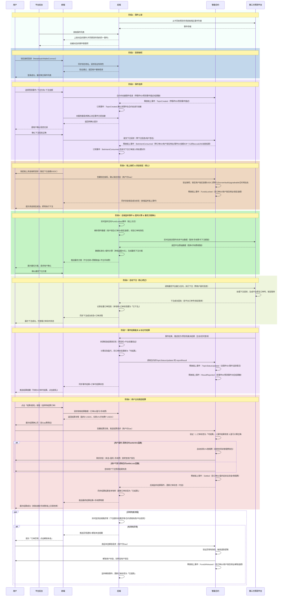

## 项目流程图

```mermaid
sequenceDiagram
    participant U as 用户
    participant B as 平台后台
    participant F as 前端
    participant G as 后端
    participant C as 智能合约
    participant T as 第三方预测平台

    %% 样式定义
 
    rect rgb(245, 255, 251)
    note over U,T: 阶段1：事件上架
    G->>T: 从不同的预测市场获取相应事件列表
    T-->>G: 事件存储
    B->>G: 获取事件列表
    G-->>F: 上架对应的事件(不同预测市场的同一事件)
    G-->>B: 创建对应的事件管理项
    end

    rect rgb(194, 215, 235)
    note over U,T: 阶段2：登录授权
    U->>F: 钱包授权登录（MetaMask/WalletConnect）
    F->>G: 同步钱包地址，请求验证有效性
    G-->>F: 验证通过，返回用户基础信息
    F-->>U: 登录成功，展示聚合事件列表
    end

    rect rgb(237, 226, 252)
    note over U,T: 阶段3：事件选择
    U->>F: 选择预测事件+下注方向+下注金额
    F->>C: 合约中创建事件信息（带事件ID/预测事件描述/结果数）
    C-->>G: 释放链上事件：TopicCreated（带事件ID/预测事件描述）
    G->>G: 订阅事件：TopicCreated,确认该事件在合约处进行创建
    F->>G: 向服务器请求确认对应事件已经创建
    G-->>F: 返回待确认提示
    F-->>U: 请用户确认信息无误
    U->>F: 确认下注信息正确
    F->>C: 提交下注请求（带下注信息/用户签名）
    C-->>G: 释放链上事件：BetIntentConsumed（带订单ID/用户钱包地址/事件ID/金额/EIP-712的keccak256加密结果）
    G->>G: 订阅事件：BetIntentConsumed,将本次下注订单放入待处理队列
    end

    rect rgb(238, 215, 193)
    note over U,T: 阶段4：链上授权 & 资金锁定（核心）
    F->>U: 发起链上资金授权请求（锁定下注金额USDC）
    U->>C: 签署钱包授权，确认锁定资金（用户付Gas）
    C->>C: 验证授权，锁定用户指定金额USDC,即转入EscrowVaultUpgradeable合约地址处
    C->>C: 释放链上事件：FundsLocked（含订单ID/用户钱包地址/锁定金额）
    C-->>F: 同步资金锁定成功状态（前端监听链上事件）
    F-->>U: 提示资金锁定成功，即将执行下注
    end

    rect rgb(196, 243, 196)
    note over U,T: 阶段5：后端监听事件 & 套利计算 & 最优方案确认
    G->>G: 实时监听合约FundLocked事件（链上日志）
    G->>G: 解析事件数据（用户钱包/订单ID/锁定金额），校验订单有效性
    G->>T: 实时拉取该事件的多平台数据（赔率/手续费/可下注额度）
    T-->>G: 返回平台原始数据（赔率/手续费/额度）
    G->>G: 数据标准化+套利计算（净收益最大化），生成最优下注方案
    G-->>F: 推送最优方案（平台名称+预期收益+平台手续费）
    F-->>U: 展示最优方案，请求用户确认
    U->>F: 确认最优下注方案
    end

    rect rgb(238, 245, 221)
    note over U,T: 阶段6：自动下注（核心修正）
    G->>T: 调用最优平台接口/合约，执行下注（带用户委托信息）
    T->>T: 处理下注请求，生成平台原生订单号，锁定赔率
    T-->>G: 下注成功回执（含平台订单号/锁定赔率）
    G->>G: 记录全量订单信息（本地库+订单状态置为「已下注」）
    G-->>F: 同步下注成功状态+订单详情
    F-->>U: 展示下注成功，可查看订单实时状态
    end

    rect rgb(242, 228, 248)
    note over U,T: 阶段7：事件结果裁决 & 标记可结算
    T->>G: 事件结束，推送官方/预言机裁决结果（主动/定时查询）
    G->>G: 多源核验结果真实性（预言机+平台双重验证）
    G->>G: 计算实际盈亏，将订单状态更新为「可结算」
    G->>C: 调用合约的TopicStatusUpdated 和 reportResult
    C->>C: 释放链上事件：TopicStatusUpdated（含事件ID/事件活跃情况）
    C->>C: 释放链上事件：ResultReported（含事件ID/预测事件对应结果数）
    G-->>F: 同步事件结果+订单可结算状态
    F-->>U: 推送结算提醒（「你的X订单可结算，点击提现」）
    end

    rect rgb(248, 224, 224)
    note over U,T: 阶段8：用户主动发起结算
    U->>F: 点击「结算/提现」按钮（选择待结算订单）
    F->>G: 请求获取结算数据（订单ID/盈亏/手续费）
    G-->>F: 返回结算详情（盈利X USDC，扣除1%手续费Y USDC）
    F->>U: 展示结算确认页（含Gas费预估）
    U->>C: 签署结算交易，发起结算请求（用户付Gas）
    C->>C: 验证：1.订单状态为「可结算」 2.事件结果有效 3.盈亏计算正确
    alt 用户盈利 调用合约settleWin函数
        C->>C: 自动扣除1%管理费（划转至项目管理费钱包）
        C->>U: 剩余资金（本金+盈利-手续费）划转至用户钱包
    else 用户亏损 调用合约settleLoss函数
        C->>U: 告知用户下注预测结果失败
    end
    C->>C: 释放链上事件：Settled（含订单ID/盈利后的总资金/管理费）
    C-->>G: 后端监听结算事件，更新订单状态（可选）
    G->>G: 同步结算结果至本地库（更新订单状态为「已结算」）
    G-->>F: 推送最终结算结果+手续费明细
    F-->>U: 展示结算成功（到账金额/手续费/链上交易哈希）
    end

    %% 全局异常兜底分支
    par 异常兜底流程
        G->>G: 实时监测全链路异常（下注超时/结果异常/合约调用失败/平台宕机）
        alt 检测到异常
            G-->>F: 推送异常通知+解锁本金提醒
            F-->>U: 提示「订单异常，点击解锁本金」
            U->>C: 发起本金解锁请求（用户付Gas）
            C->>C: 验证异常有效性，触发退款逻辑
            C->>U: 解锁用户本金，划转至用户钱包
            C->>C: 释放链上事件：FundsReleased（含订单ID/用户钱包地址/解锁金额）
            G->>G: 监听解锁事件，更新订单状态为「已退款」
        end
    end
```